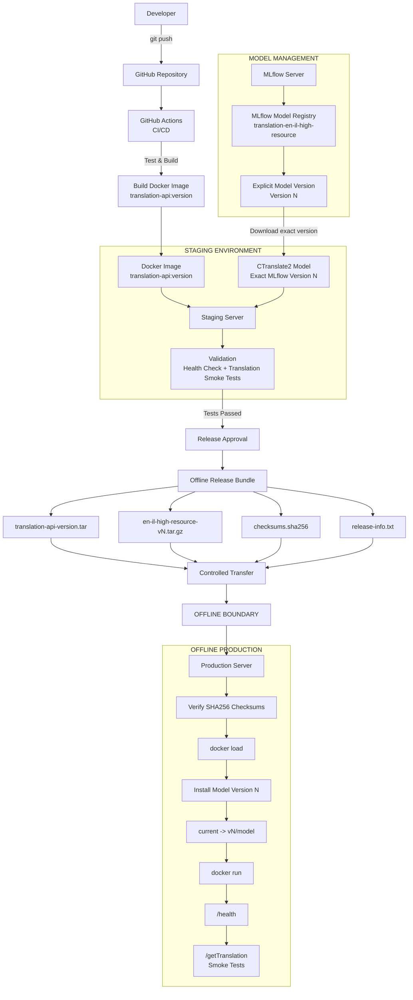

# Translation API --- MLOps Deployment

This repository contains the FastAPI application and deployment
components for a CTranslate2-based translation service.

The deployment keeps the **application** and **translation model**
separately versioned:

-   **GitHub** --- source code and CI/CD
-   **GitHub Actions** --- tests, Docker builds, staging/release
    automation
-   **Docker** --- packages and runs the FastAPI application
-   **MLflow** --- stores and versions translation model artifacts
-   **Staging** --- validates an exact application + model version
-   **Production** --- receives approved artifacts through a controlled
    offline transfer

## Architecture



## Repository Structure

``` text
translation-api/
├── app/
│   ├── main.py
│   └── ...
├── tests/
├── scripts/
│   ├── download_model.py
│   ├── deploy_staging.sh
│   └── create_offline_release.sh
├── Dockerfile
├── requirements-python310.txt
├── .gitignore
├── README.md
└── .github/
    └── workflows/
        ├── ci.yml
        ├── staging.yml
        └── release.yml
```

Do **not** commit large model artifacts such as `model.bin` or versioned
CTranslate2 model directories to Git. Models are managed through MLflow
and the deployment filesystem.

## Docker Image

Current Dockerfile:

``` dockerfile
FROM python:3.10-slim

ENV PYTHONDONTWRITEBYTECODE=1
ENV PYTHONUNBUFFERED=1

WORKDIR /app

COPY requirements-python310.txt .

RUN pip install --no-cache-dir -r requirements-python310.txt

COPY app ./app

EXPOSE 8000

CMD ["uvicorn", "app.main:app", "--host", "0.0.0.0", "--port", "8000"]
```

The image contains the Linux/Python runtime, Python dependencies,
FastAPI application, Uvicorn, CTranslate2 when included in the
requirements, and application source code.

The translation model is kept **outside** the Docker image and mounted
at runtime. This allows application and model versions to change
independently.

## Model Filesystem Layout

The application expects the active model inside the container at:

``` text
/app/app/Translation_Models/en-il-high-resource/
```

On staging/production, models are stored by version:

``` text
/opt/translation-models/
└── en-il-high-resource/
    ├── v1/
    │   └── model/
    ├── v2/
    │   └── model/
    │       ├── model.bin
    │       ├── config.json
    │       └── ...
    └── current -> v2/model
```

`current` is a symbolic link to the active model:

``` bash
cd /opt/translation-models/en-il-high-resource
ln -sfn v2/model current
```

## MLflow Model Management

Registered model:

``` text
translation-en-il-high-resource
```

Deploy an **explicit MLflow version**, not an unspecified latest
version.

Example release:

``` text
Application: translation-api:1.4.2
Model:       translation-en-il-high-resource
MLflow Version: 2
```

Example MLflow URI:

``` text
models:/translation-en-il-high-resource/2
```

Example downloader usage:

``` bash
python scripts/download_model.py \
  --model-name translation-en-il-high-resource \
  --version 2 \
  --output /opt/translation-models/en-il-high-resource/v2
```

After download, locate and verify the actual CTranslate2 model directory
and confirm that `model.bin` and the other required model files exist.

## Build and Run Docker

Build:

``` bash
docker build -t translation-api:1.4.2 .
```

Run with the active model mounted read-only:

``` bash
docker run -d \
  --name translation-api \
  -p 8000:8000 \
  -v /opt/translation-models/en-il-high-resource/current:/app/app/Translation_Models/en-il-high-resource:ro \
  translation-api:1.4.2
```

Mapping:

``` text
HOST
/opt/translation-models/en-il-high-resource/current
                         |
                         | read-only volume
                         v
CONTAINER
/app/app/Translation_Models/en-il-high-resource/
```

## Verify Deployment

``` bash
docker ps
docker logs translation-api
```

Verify the model inside the container:

``` bash
docker exec translation-api \
  ls -lh /app/app/Translation_Models/en-il-high-resource/
```

Health check:

``` bash
curl http://127.0.0.1:8000/health
```

After health succeeds, run known smoke-test requests against
`/getTranslation`.

## GitHub CI/CD

Typical flow:

``` text
git push
   |
GitHub
   |
GitHub Actions
   |
   +-- Install dependencies
   +-- Run tests
   +-- Build Docker image
   +-- Tag exact application version
   +-- Push image to container registry
   +-- Deploy to staging
   +-- Download exact MLflow model version
   +-- Health check
   +-- Translation smoke test
   |
Release approval
```

Example `.github/workflows/ci.yml`:

``` yaml
name: CI

on:
  push:
    branches: [main]
  pull_request:

jobs:
  test:
    runs-on: ubuntu-latest

    steps:
      - name: Checkout
        uses: actions/checkout@v4

      - name: Setup Python
        uses: actions/setup-python@v5
        with:
          python-version: "3.10"

      - name: Install dependencies
        run: pip install -r requirements-python310.txt

      - name: Run tests
        run: pytest
```

Additional workflows can handle Docker builds, staging deployment, and
release creation.

## Self-Hosted GitHub Runner

If staging and MLflow are inside the company network, a self-hosted
runner can execute deployment jobs from an authorized internal machine:

``` text
GitHub
   ^
   | outbound connection
   |
Company Network
   |
GitHub Runner
   +----> Staging
   +----> MLflow
```

Do not expose MLflow or staging publicly only for CI/CD. Follow
organizational network and access-control requirements.

## Staging Deployment

Staging can access MLflow.

Deployment sequence:

``` text
1. Select exact Docker application version
2. Select explicit MLflow model version
3. Download model
4. Inspect downloaded artifact
5. Verify CTranslate2 files/model.bin
6. Update `current` symlink
7. Start Docker container
8. Verify files inside container
9. Check logs
10. Call /health
11. Test /getTranslation
12. Record successful application + model combination
```

Example:

``` text
Docker: translation-api:1.4.2
Model:  translation-en-il-high-resource Version 2
```

The same approved model version/artifact should be promoted to
production.

## Offline Production Release

Production does not need direct access to GitHub, the container
registry, or MLflow.

Prepare:

``` text
release-1.4.2/
├── translation-api-1.4.2.tar
├── en-il-high-resource-v2.tar.gz
├── checksums.sha256
└── release-info.txt
```

`release-info.txt` should record at least:

``` text
Application: translation-api:1.4.2
Model: translation-en-il-high-resource
MLflow Model Version: 2
```

### Export Docker Image

On a connected machine:

``` bash
docker pull YOUR_REGISTRY/translation-api:1.4.2

docker save \
  -o translation-api-1.4.2.tar \
  YOUR_REGISTRY/translation-api:1.4.2
```

The `.tar` can be transferred using the organization's approved process.

### Package the Model

Export/download the **same exact model version that passed staging**,
then package it:

``` bash
tar -czf en-il-high-resource-v2.tar.gz en-il-high-resource-v2/
```

### Generate Checksums

``` bash
sha256sum \
  translation-api-1.4.2.tar \
  en-il-high-resource-v2.tar.gz \
  > checksums.sha256
```

Transfer the Docker tar, model archive, checksum file, and release
metadata together.

## Offline Production Installation

Verify integrity first:

``` bash
sha256sum -c checksums.sha256
```

Expected:

``` text
translation-api-1.4.2.tar: OK
en-il-high-resource-v2.tar.gz: OK
```

Do not deploy files that fail verification.

Load Docker:

``` bash
docker load -i translation-api-1.4.2.tar
docker images
```

Create the model root if necessary:

``` bash
sudo mkdir -p /opt/translation-models/en-il-high-resource
```

Extract the model into its version-specific directory and verify:

``` bash
test -f /opt/translation-models/en-il-high-resource/v2/model/model.bin \
  && echo "model.bin OK"
```

Activate it:

``` bash
cd /opt/translation-models/en-il-high-resource
ln -sfn v2/model current
test -f current/model.bin && echo "Current model OK"
```

Start production:

``` bash
docker run -d \
  --name translation-api \
  -p 8000:8000 \
  -v /opt/translation-models/en-il-high-resource/current:/app/app/Translation_Models/en-il-high-resource:ro \
  translation-api:1.4.2
```

Verify:

``` bash
docker ps
docker logs translation-api

docker exec translation-api \
  ls -lh /app/app/Translation_Models/en-il-high-resource/

curl http://127.0.0.1:8000/health
```

Then run `/getTranslation` smoke tests.

## Independent Versioning

Application and model versions are independent:

``` text
Release A:
Application = translation-api:1.4.2
Model       = MLflow Version 2

Release B:
Application = translation-api:1.4.2
Model       = MLflow Version 3

Release C:
Application = translation-api:1.5.0
Model       = MLflow Version 3
```

A model-only update does not necessarily require rebuilding the Docker
application image.

## Rollback

Keep previously approved application images and model versions until the
new release is validated.

Example:

``` text
/opt/translation-models/en-il-high-resource/
├── v1/model/
├── v2/model/
└── current -> v2/model
```

Model rollback:

``` bash
cd /opt/translation-models/en-il-high-resource
ln -sfn v1/model current
```

Restart/recreate the application container as required so it loads the
intended model.

Application rollback uses the previously approved Docker image tag.

Rollback should use a previously recorded and validated
application/model combination rather than selecting versions
independently without validation.

## Deployment Rules

1.  Use explicit Docker and MLflow model versions.
2.  Do not deploy an unspecified `latest` model.
3.  Validate the exact application/model combination on staging.
4.  Promote the same validated model artifact to production.
5.  Keep model artifacts outside Git.
6.  Generate and verify checksums for offline transfer.
7.  Mount production models read-only into Docker.
8.  Keep previous approved versions available for rollback.
9.  Run health and translation smoke tests after deployment.
10. Record the exact application version and model version for every
    release.

## Component Responsibilities

  -----------------------------------------------------------------------
  Component                           Responsibility
  ----------------------------------- -----------------------------------
  GitHub                              Source code and collaboration

  GitHub Actions                      CI/CD automation

  Container Registry                  Docker image storage

  Docker                              Application runtime/package

  MLflow                              Model registry, versions, and
                                      artifacts

  Staging                             Validate exact application + model
                                      combination

  Offline release bundle              Carry approved artifacts across
                                      offline boundary

  Production                          Run approved Docker image and model
  -----------------------------------------------------------------------

## Summary

``` text
GitHub manages CODE
        +
MLflow manages MODELS
        +
Docker runs the APPLICATION
        +
Staging validates an exact combination
        +
Production receives the SAME approved artifacts
```

For an offline production environment:

``` text
docker pull -> connected environment
docker save -> transferable Docker image file
docker load -> offline production
```

The offline production server therefore does not require direct access
to GitHub, the Docker registry, or MLflow when using this release
process.
